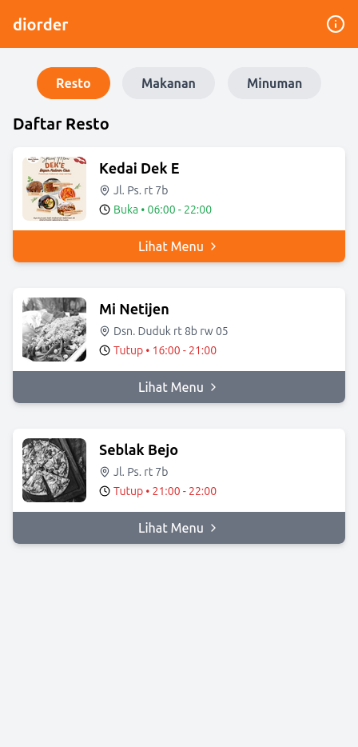
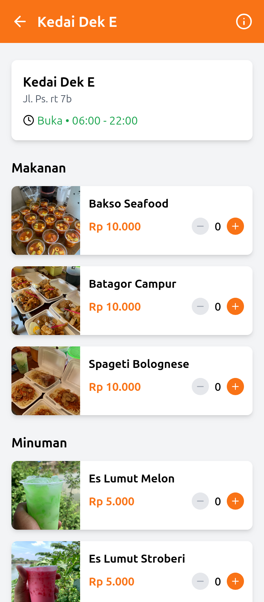
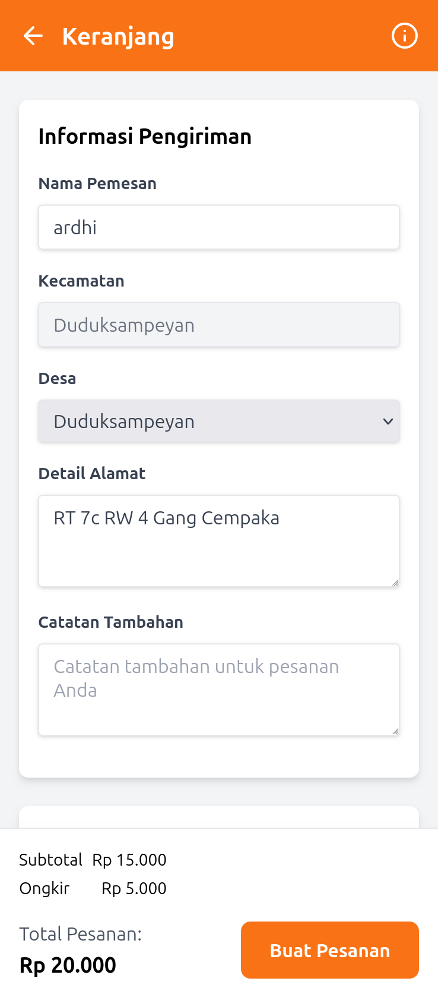
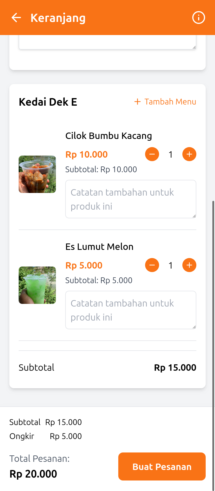

<div align="center">
  <h1>Diorder - Pesan Makanan Online</h1>
</div>

**Diorder** adalah aplikasi pemesanan makanan online berbasis web yang dirancang untuk mempermudah pengguna dalam memesan makanan dari berbagai merchant. Dengan antarmuka yang sederhana dan integrasi WhatsApp, aplikasi ini memberikan pengalaman pemesanan yang cepat dan efisien.

---

## **Fitur Utama**

- **Daftar Merchant**: Menampilkan merchant dengan informasi lengkap (nama, alamat, logo, jam operasional).
- **Menu Makanan & Minuman**: Menampilkan menu dari setiap merchant dengan kategori makanan dan minuman.
- **Keranjang Belanja**: Menyimpan pesanan sementara dengan fitur edit jumlah, catatan, dan penghapusan item.
- **Checkout via WhatsApp**: Mengirim detail pesanan langsung ke kurir melalui WhatsApp.
- **Status Merchant**: Menampilkan status buka/tutup merchant berdasarkan jam operasional.
- **Pencarian**: Fitur pencarian untuk menemukan makanan, minuman, atau merchant dengan cepat.

<!-- ## **Diorder vs Kompetitor** -->
<br>
<br>
<br>
<div align="center">
  <h1>Diorder vs Competitor</h1>
</div>

### 🏆 **Mengapa Memilih Diorder?**

Berikut perbandingan Diorder dengan aplikasi pemesanan makanan mainstream seperti ShopeeFood dan GoFood:

| Fitur                       | Diorder                                                       | Kompetitor                                           |
| --------------------------- | ------------------------------------------------------------- | ---------------------------------------------------- |
| 🚚 **Biaya Pengiriman**     | **Flat Rp 5.000** untuk seluruh Kecamatan Duduksampeyan       | Ongkir dinamis berdasarkan jarak (bisa sangat mahal) |
| 💰 **Harga Menu**           | **Harga asli restoran** tanpa markup                          | Markup 15-30% dari harga asli di restoran            |
| 🛒 **Multi-Restoran**       | **Pesan dari beberapa restoran sekaligus** dengan satu ongkir | Hanya satu restoran per pesanan, ongkir terpisah     |
| 🔐 **Registrasi**           | **Tanpa registrasi/login** - langsung pesan                   | Wajib registrasi, verifikasi, dan login              |
| 💸 **Biaya Tambahan**       | **Tidak ada biaya layanan** tersembunyi                       | Biaya layanan, biaya platform, dll                   |
| 📱 **Instalasi**            | **PWA berbasis web** - tidak perlu unduh aplikasi             | Perlu mengunduh dan menginstal aplikasi              |
| ⏱️ **Kecepatan Pengiriman** | **Lebih cepat** karena fokus hyperlocal                       | Bergantung pada ketersediaan pengantar di area       |
| 🤝 **Komunikasi**           | **Langsung via WhatsApp** dengan pengantar                    | Melalui sistem pesan aplikasi yang terbatas          |

### 💯 **Keunggulan Utama**

<table>
  <tr>
    <td width="50%" align="center">
      
      <h3>Satu Ongkir, Banyak Restoran</h3>
      <p>Pesan dari berbagai restoran sekaligus tanpa biaya pengiriman tambahan.</p>
    </td>
    <td width="50%" align="center">
      
      <h3>Harga Asli Restoran</h3>
      <p>Tidak ada markup harga - apa yang Anda lihat adalah apa yang Anda bayar.</p>
    </td>
  </tr>
  <tr>
    <td width="50%" align="center">
      
      <h3>Fokus Lokal</h3>
      <p>Layanan khusus untuk Kecamatan Duduksampeyan dengan pemahaman kebutuhan lokal.</p>
    </td>
    <td width="50%" align="center">
      
      <h3>Langsung via WhatsApp</h3>
      <p>Checkout sederhana melalui platform yang sudah familiar tanpa perlu aplikasi tambahan.</p>
    </td>
  </tr>
</table>

### 📊 **Perbandingan Biaya**

<div align="center">
  <table>
    <tr>
      <th>Skenario Pemesanan</th>
      <th>Diorder</th>
      <th>Kompetitor</th>
      <th>Anda Hemat</th>
    </tr>
    <tr>
      <td>Pesanan dari 1 restoran (Rp 50.000)</td>
      <td>Rp 55.000</td>
      <td>Rp 70.000*</td>
      <td><b>Rp 15.000</b></td>
    </tr>
    <tr>
      <td>Pesanan dari 2 restoran (Rp 40.000 + Rp 35.000)</td>
      <td>Rp 80.000</td>
      <td>Rp 115.000*</td>
      <td><b>Rp 35.000</b></td>
    </tr>
    <tr>
      <td>Pesanan dari 3 restoran (Rp 25.000 + Rp 30.000 + Rp 45.000)</td>
      <td>Rp 105.000</td>
      <td>Rp 155.000*</td>
      <td><b>Rp 50.000</b></td>
    </tr>
  </table>
  <p><i>* Perkiraan biaya kompetitor termasuk markup harga 20%, ongkir rata-rata Rp 12.000 per restoran, dan biaya layanan.</i></p>
</div>

### 🎯 **Untuk Siapa Diorder Cocok?**

- ✅ **Keluarga** dengan anggota yang memiliki preferensi restoran berbeda
- ✅ **Kantor/Perusahaan** yang ingin memesan makan siang dari berbagai tempat
- ✅ **Kost/Kontrakan** dengan penghuni yang ingin patungan pesan makanan
- ✅ **Acara kecil/arisan** yang membutuhkan variasi menu dari berbagai restoran
- ✅ **Pengguna yang menghargai transparansi harga** tanpa biaya tersembunyi

Diorder - **Satu Aplikasi, Banyak Pilihan, Satu Ongkir!**

---

## **Flow Aplikasi**

1. **Halaman Utama**:

   - Pengguna melihat daftar merchant yang tersedia.
   - Fitur pencarian untuk mencari merchant, makanan, atau minuman.
   - Tab navigasi untuk beralih antara daftar merchant, makanan, dan minuman.

2. **Halaman Menu Merchant**:

   - Pengguna memilih merchant untuk melihat daftar menu yang tersedia.
   - Pengguna dapat menambahkan item ke keranjang.

3. **Halaman Keranjang**:

   - Pengguna melihat item yang telah ditambahkan ke keranjang.
   - Pengguna dapat mengedit jumlah item, menambahkan catatan, atau menghapus item.
   - Informasi pengiriman diisi oleh pengguna.

4. **Checkout**:
   - Detail pesanan dikirim ke WhatsApp kurir untuk diproses.
   - Kurir memesan makanan ke merchant dan mengantarkannya ke pengguna.

---

## **Tech Stack**

### **Frontend**

- **React**: Framework utama untuk membangun antarmuka pengguna.
- **TypeScript**: Untuk memastikan tipe data yang konsisten.
- **Tailwind CSS**: Untuk styling yang cepat dan responsif.
- **Vite**: Build tool untuk pengembangan yang cepat.

---

## **Instalasi**

### **1. Clone Repository**

Clone repository ini ke komputer Anda:

```bash
git clone https://github.com/username/diorder.git
cd diorder
```

### **2. Instal Dependensi**

Pastikan Anda telah menginstal **Node.js** dan **npm**. Kemudian jalankan perintah berikut:

```bash
npm install
```

### **3. Jalankan Aplikasi**

Untuk menjalankan aplikasi dalam mode pengembangan:

```bash
npm run dev
```

Akses aplikasi di [http://localhost:5173](http://localhost:5173).

### **4. Build untuk Produksi**

Untuk membuat build produksi:

```bash
npm run build
```

Hasil build akan tersedia di folder `dist`.

---

## **Struktur Direktori**

```
diorder/
├── src/
│   ├── components/    # Komponen UI
│   ├── context/       # Context API untuk state management
│   ├── data/          # Data dummy merchant dan menu
│   ├── pages/         # Halaman utama aplikasi
│   ├── types/         # Definisi tipe TypeScript
│   ├── utils/         # Fungsi utilitas
│   ├── App.tsx        # Entry point aplikasi
│   └── main.tsx       # File utama untuk render aplikasi
├── public/            # File statis (gambar, favicon, dll)
├── index.html         # File HTML utama
├── package.json       # Konfigurasi npm
├── tailwind.config.js # Konfigurasi Tailwind CSS
└── vite.config.ts     # Konfigurasi Vite
```

---

## **Kontribusi**

Kontribusi sangat diterima! Jika Anda menemukan bug atau memiliki ide untuk fitur baru, silakan buat **issue** atau kirimkan **pull request**.

---

## **Lisensi**

Proyek ini dilisensikan di bawah [MIT License](LICENSE).

---

## **Screenshots**

### **Halaman Utama**

Menampilkan daftar merchant dengan status buka/tutup.



### **Halaman Menu**

Menampilkan menu makanan dan minuman dari merchant yang dipilih.



### **Halaman Keranjang**

Menampilkan item yang ditambahkan ke keranjang dengan opsi checkout.




<br>
<br>
<br>

<div align="center">
  <h2>🚀 Strategi Pengembangan Bisnis Bertahap 🚀</h2>
  <p><i>Monetisasi yang adil dan tidak membebani pengguna</i></p>
</div>

<p align="center">
  
</p>

Diorder dirancang dengan pendekatan bertumbuh bersama - membangun ekosistem yang menguntungkan bagi semua pihak tanpa menaikkan biaya kepada pengguna secara signifikan.

### 📈 **Fase Pengembangan Bisnis**

<table>
  <tr>
    <th align="center">Fase</th>
    <th align="center">Fokus</th>
    <th align="center">Strategi Monetisasi</th>
  </tr>
  <tr>
    <td align="center"><b>Fase 1</b><br/><i>0-6 bulan</i><br/>🌱 Tumbuh</td>
    <td>
      <ul>
        <li>Membangun basis pengguna awal</li>
        <li>Meningkatkan awareness di Duduksampeyan</li>
        <li>Menjalin kemitraan dengan restoran lokal</li>
      </ul>
    </td>
    <td>
      <ul>
        <li>Zero profit model - fokus pada pertumbuhan</li>
        <li>Hanya mengambil Rp 1.000 dari setiap ongkir</li>
        <li>Target: 1.000 pesanan/bulan</li>
      </ul>
    </td>
  </tr>
  <tr>
    <td align="center"><b>Fase 2</b><br/><i>6-12 bulan</i><br/>🌿 Monetisasi Ringan</td>
    <td>
      <ul>
        <li>Optimalisasi tanpa menaikkan harga</li>
        <li>Peningkatan layanan merchant</li>
        <li>Penambahan fitur berbasis feedback</li>
      </ul>
    </td>
    <td>
      <ul>
        <li>Komisi merchant 5% (bukan dari pengguna)</li>
        <li>Layanan pengiriman prioritas (+Rp 2.000, opsional)</li>
        <li>Program merchant premium (Rp 50-100rb/bulan)</li>
      </ul>
    </td>
  </tr>
  <tr>
    <td align="center"><b>Fase 3</b><br/><i>12-24 bulan</i><br/>🌳 Ekspansi</td>
    <td>
      <ul>
        <li>Ekspansi ke kecamatan sekitar</li>
        <li>Diversifikasi layanan</li>
        <li>Program loyalitas pengguna</li>
      </ul>
    </td>
    <td>
      <ul>
        <li>Diorder+ Membership opsional (Rp 15rb/bulan)</li>
        <li>Program "Diorder untuk Bisnis" (katering kantor)</li>
        <li>Fitur pre-order dan reservasi</li>
      </ul>
    </td>
  </tr>
  <tr>
    <td align="center"><b>Fase 4</b><br/><i>24+ bulan</i><br/>🌲 Ekosistem</td>
    <td>
      <ul>
        <li>Solusi lokal komprehensif</li>
        <li>Integrasi dengan UMKM lokal</li>
        <li>Pengembangan komunitas pengguna</li>
      </ul>
    </td>
    <td>
      <ul>
        <li>Diorder Hub - marketplace UMKM lokal</li>
        <li>Solusi B2B untuk bisnis dan acara</li>
        <li>Opsi white label untuk restoran</li>
      </ul>
    </td>
  </tr>
</table>

### 💎 **Prinsip Monetisasi Berkelanjutan**

<div style="display: flex; justify-content: space-between; flex-wrap: wrap;">
  <div style="flex: 1; min-width: 250px; margin: 10px; padding: 15px; border-radius: 10px; background-color: #f8f9fa; box-shadow: 0 2px 5px rgba(0,0,0,0.1);">
    <h4 style="color: #2e7d32; margin-top: 0;">✅ Transparansi Harga</h4>
    <p style="color: #333333; font-weight: 500;">Tetap mempertahankan tidak ada markup harga menu</p>
  </div>
  <div style="flex: 1; min-width: 250px; margin: 10px; padding: 15px; border-radius: 10px; background-color: #f8f9fa; box-shadow: 0 2px 5px rgba(0,0,0,0.1);">
    <h4 style="color: #1565c0; margin-top: 0;">✅ Value-First Approach</h4>
    <p style="color: #333333; font-weight: 500;">Setiap fitur berbayar memberikan nilai jelas bagi pengguna</p>
  </div>
  <div style="flex: 1; min-width: 250px; margin: 10px; padding: 15px; border-radius: 10px; background-color: #f8f9fa; box-shadow: 0 2px 5px rgba(0,0,0,0.1);">
    <h4 style="color: #6a1b9a; margin-top: 0;">✅ Pilihan Pengguna</h4>
    <p style="color: #333333; font-weight: 500;">Semua fitur premium bersifat opsional</p>
  </div>
  <div style="flex: 1; min-width: 250px; margin: 10px; padding: 15px; border-radius: 10px; background-color: #f8f9fa; box-shadow: 0 2px 5px rgba(0,0,0,0.1);">
    <h4 style="color: #c62828; margin-top: 0;">✅ Pertumbuhan Bersama</h4>
    <p style="color: #333333; font-weight: 500;">Berbagi keuntungan dengan merchant melalui peningkatan penjualan</p>
  </div>
  <div style="flex: 1; min-width: 250px; margin: 10px; padding: 15px; border-radius: 10px; background-color: #f8f9fa; box-shadow: 0 2px 5px rgba(0,0,0,0.1);">
    <h4 style="color: #e65100; margin-top: 0;">✅ Reinvestasi</h4>
    <p style="color: #333333; font-weight: 500;">30% keuntungan awal diinvestasikan kembali untuk pengembangan</p>
  </div>
</div>

<!-- ### 📊 **Proyeksi Pendapatan Bertahap**

<div align="center">
  <table>
    <tr>
      <th width="15%">Fase</th>
      <th width="40%">Sumber Pendapatan</th>
      <th width="45%">Estimasi/Bulan</th>
    </tr>
    <tr>
      <td align="center">1️⃣</td>
      <td>Porsi Ongkir (Rp 1.000/pesanan)</td>
      <td align="right">Rp 1.000.000 <small><i>(1.000 pesanan)</i></small></td>
    </tr>
    <tr>
      <td align="center">2️⃣</td>
      <td>Porsi Ongkir + Komisi Merchant + Layanan Premium</td>
      <td align="right">Rp 3.000.000 - 5.000.000</td>
    </tr>
    <tr>
      <td align="center">3️⃣</td>
      <td>Semua sumber di atas + Membership + Ekspansi</td>
      <td align="right">Rp 10.000.000 - 15.000.000</td>
    </tr>
    <tr>
      <td align="center">4️⃣</td>
      <td>Ekosistem lengkap dengan multiple revenue streams</td>
      <td align="right">Rp 25.000.000+</td>
    </tr>
  </table>
</div> -->

<div align="center">
  <p><b>Diorder</b> - Bertumbuh bersama komunitas, mengutamakan nilai, dan membangun ekosistem lokal yang berkelanjutan.</p>
</div>

---

## **Kontak**

Jika Anda memiliki pertanyaan atau saran, silakan hubungi kami melalui [WhatsApp](https://wa.me/628888465289).
